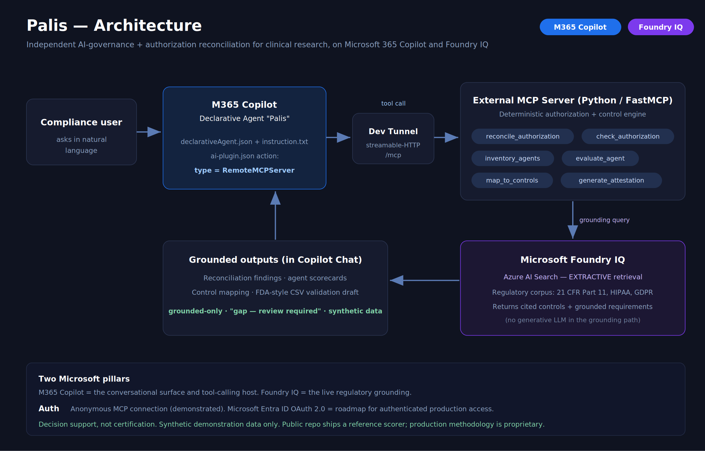

# Palis

**An independent compliance agent for clinical research, in Microsoft 365 Copilot.**

Palis verifies whether the **people and AI agents on a clinical study were actually authorized to do what they did** — reconciling real study activity against the signed Delegation of Authority Log (DOAL) and credential timeline, and grounding every finding in cited regulation (21 CFR Part 11, HIPAA, GDPR). It is a Microsoft 365 Copilot **declarative agent** backed by an external **MCP server**, with regulatory citations grounded live in **Microsoft Foundry IQ**. Built for the **Enterprise Agents** track of the Microsoft Agents League.

> ⚠️ **Synthetic demonstration.** All tenant, agent, study, staff, and patient data in this repository is fabricated. Palis is a **decision-support and evidence-preparation tool** — not a system of record and not a validated compliance system.



<sub>Editable source: [`docs/architecture.svg`](docs/architecture.svg)</sub>

---

## What problem this solves

On a clinical trial, a coordinator can perform informed consent *before* she is authorized on the delegation log — before the delegation is effective, or before the PI has signed it. The log looks valid today; the violation was in the **timing**, and it routinely goes uncaught until an audit, where it becomes a documented deviation.

Tools that manage the DOAL as a *document* — store it, version it, e-sign it, send reminders — don't catch this, because they manage the log's current state, not whether each act was authorized at the moment it occurred. **That temporal reconciliation is the gap Palis fills:** it cross-checks the activity record against the authorization timeline and flags the task performed before delegation, the expired GCP certification, and the undelegated performer — each with the cited control it breaks. It can also gate a task *proactively*, before it happens.

The same engine governs the other actor in the study: the **Copilot agents** handling that study's regulated data, scored for PHI handling against the same cited controls.

**Honest positioning:** Palis is decision support, not certification — a first-line screen and evidence-preparation aid. It encodes a focused set of controls against synthetic data; it is not a complete or certified compliance engine. It complements Microsoft's stack (Purview, Agent 365 surface generic posture); Palis adds the regulated-domain reconciliation and cited-control translation they don't attempt.

---

## How it works

Palis is a declarative agent (Copilot provides the model and orchestration) that calls an external **MCP server** exposing **six tools**:

**Agent-governance pipeline**
1. `inventory_agents` — discover the Copilot agents in the tenant and the data each touches
2. `evaluate_agent` — score one agent's regulated-data posture (deterministic, explainable rules → per-dimension scores → RED/AMBER/GREEN band)
3. `map_to_controls` — translate each gap into a specific, *cited* regulatory control (grounded via Foundry IQ)
4. `generate_attestation` — produce a control-by-control evidence pack, including an FDA-style Computer System Validation (CSV) draft (Document Control, Risk Register, URS/FS, Traceability Matrix, IQ/OQ/PQ drafts, Deviations, CAPA, Validation Conclusion)

**Credentialing & temporal authorization (the standout)**
5. `reconcile_authorization` — reconcile study activity against the DOAL timeline; catch tasks performed before delegation/PI-signature, expired credentials, and undelegated performers; each finding cited
6. `check_authorization` — proactive pre-task gate: confirm a staff member is on the current DOAL, PI-signed, in scope, and credentialed as of that date — preventing the deviation rather than documenting it

**Detection is deterministic, not an LLM judgment.** The reconciliation is date and credential logic — an auditor tool must be deterministic, and Palis never asks a model to *decide* whether an act was authorized. The model layer only **grounds** the cited regulation text.

**Safety rule enforced in code:** a gap is never reported without a grounded citation, the agent never labels anything "compliant" or "non-compliant" (only "gap — review required"), and evidence the tools don't return is marked as a placeholder rather than fabricated.

### Microsoft technology (required components)

- **Microsoft 365 Copilot** — Palis is a declarative agent surfaced in Copilot Chat. An `ai-plugin.json` action of type `RemoteMCPServer` connects the agent to the external MCP server; Copilot performs the live tool calls. Verified working end to end.
- **Microsoft Foundry IQ** — the regulatory grounding layer, via **Azure AI Search extractive retrieval**. Cited controls and grounded requirements are returned for citation **without a generative LLM in the grounding path**, so references reflect the source corpus rather than model memory. This is the required IQ component and is demonstrated live.

---

## Run locally

The MCP server runs anonymously (no OAuth needed) and is exposed to Copilot over HTTPS with a Microsoft Dev Tunnel. There are two ways to run it.

### Option A — Mock mode (zero Azure, fully functional demo)
```bash
cd mcp_server
pip install -r requirements.txt
export PALIS_MOCK_MODE=true        # deterministic; grounded snippets bundled
unset PALIS_REQUIRE_AUTH           # anonymous mode
python3 server.py                  # serves Streamable HTTP at /mcp on :8000
```

### Option B — Live Foundry IQ grounding (Azure AI Search)
Build the index once from `references/regulatory-sources.md` (see `mcp_server/build_index.py`), then:
```bash
cd mcp_server
unset PALIS_REQUIRE_AUTH
export AZURE_SEARCH_ENDPOINT=https://<your-search-service>.search.windows.net
export AZURE_SEARCH_INDEX=palis-reg-index
export AZURE_SEARCH_API_KEY=$(cat ~/.palis-secrets/search-query.key)   # query key; least privilege
export PALIS_MOCK_MODE=false
python3 server.py
```
> Set env vars in the **same terminal** the server launches from. `PALIS_REQUIRE_AUTH` is the only switch for auth mode. Never commit keys — secrets live outside the repo (e.g. `~/.palis-secrets/`, chmod 600).

### Expose to Copilot (separate terminal, keep running)
```bash
devtunnel host -p 8000 --allow-anonymous
```
Copy the tunnel's browser URL (the `-8000` subdomain form, e.g. `https://<id>-8000.<region>.devtunnels.ms`). **The tunnel URL changes on every restart** — server and tunnel must both be running for any tool call.

### Connect the declarative agent (Microsoft 365 Agents Toolkit)
1. In `appPackage/ai-plugin.json`, set `spec.url` to your current tunnel URL with `/mcp` appended (replace the `REPLACE-WITH-CURRENT-TUNNEL...` placeholder).
2. Provision the agent to the local environment via the Agents Toolkit.
3. Open Copilot Chat, select **Palis**, and try: *"List the Copilot agents in the tenant"*, *"Evaluate AGT-NB-002"*, *"Reconcile the authorization records for study STUDY-NB-2026-014"*, *"Create a full CSV validation package for AGT-NB-002."*

> **`appPackage/ai-plugin.json` is maintained by hand** as a `RemoteMCPServer` manifest (the toolkit's "Fetch action from MCP" was unreliable in this build). The repo ships it with a **placeholder URL and no secrets** — set your live tunnel URL locally only; never commit it.

---

## Repository layout

```
palis/
├─ README.md                          this file
├─ references/regulatory-sources.md   public regulatory sources (grounding corpus)
├─ data/
│  ├─ tenant.json                     synthetic tenant: 7 agents (5 touch PHI)
│  └─ study-authorization.json        synthetic DOAL + activity log (temporal-gap demo)
├─ mcp_server/
│  ├─ server.py                       MCP server: the 6 tools (FastMCP, streamable-http)
│  ├─ control_library.py              gap → named, cited regulatory control
│  ├─ reference_scorer.py             transparent reference scorer (prod method NOT included)
│  ├─ authorization_reconciler.py     temporal authorization reconciliation (the standout)
│  ├─ foundry_grounding.py            Azure AI Search extractive grounding (+ mock fallback)
│  ├─ build_index.py                  one-time Foundry IQ index builder
│  └─ requirements.txt
├─ appPackage/
│  ├─ declarativeAgent.json           agent identity + actions (v1.7)
│  ├─ ai-plugin.json                  RemoteMCPServer action (placeholder URL — set locally)
│  ├─ instruction.txt                 agent behavior / grounded-only guardrails
│  └─ mcp-tools.json                  tool definitions
└─ docs/
   ├─ architecture.svg                architecture diagram
   ├─ project-description.md          submission project description
   ├─ demo-script-final.md            demo recording script
   └─ build-journal.md                build notes
```

---

## Status & honest limitations

| Component | Status |
|---|---|
| Six-tool MCP pipeline | ✅ working; verified live in Copilot Chat |
| Temporal authorization reconciliation + proactive gate | ✅ working, deterministic, tested |
| Agent governance + cited control mapping | ✅ working; reference scorer transparent and tested |
| FDA-style CSV validation package | ✅ generated end to end; grounded, gap-flagged, marked as a draft |
| Foundry IQ grounding | ✅ live via Azure AI Search **extractive** retrieval; mock mode fully functional fallback (no LLM) |
| Authenticated production access (Entra OAuth 2.0) | 🔧 roadmap — anonymous connection is used for the demo; OAuth is an integration point, not finished code |
| Telemetry → Foundry portal (OpenTelemetry) | 🔧 hook stubbed |

These are deliberately left as clearly-marked integration points rather than fake implementations.

---

## Honest scope

Palis is **decision support and audit preparation — not certification, and not a system of record.** All demonstration data is synthetic. The grounded control set is focused (Part 11, HIPAA, GDPR special-category) rather than exhaustive, and the validation packages it produces are **drafts that flag the evidence still required**, not proof of a validated state. Production use against real data would require authenticated access (OAuth/Entra), a hardened and expanded regulatory corpus, and a formal security review.

**IP note:** `reference_scorer.py` is a simplified, transparent reference implementation so the public repo is runnable and auditable. The production scoring methodology is proprietary and is **not** contained in this repository.

**Data & sources:** No real PHI, patients, staff, studies, or tenant configuration. The regulatory knowledge base draws on **public** regulation text and official guidance only (see `references/regulatory-sources.md`). Palis complements, and does not replace, Microsoft Purview and Microsoft Agent 365.
